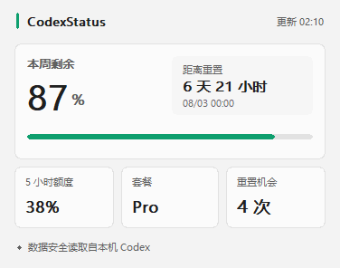
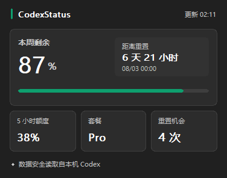

<div align="center">

# CodexStatus

**Your Codex quota, readable at a glance in the Windows tray.**

[简体中文](README.zh-CN.md) · [Download](https://github.com/bagpipes625-cloud/codex-status/releases/latest) · [Report an issue](https://github.com/bagpipes625-cloud/codex-status/issues)

</div>

| Light | Dark |
|:--:|:--:|
|  |  |

CodexStatus is a tiny native Windows utility. Its notification-area icon is the selected five-hour or weekly quota—`0` to `100`, or `--` when unavailable. With both windows available, the two-pixel rule tracks the other quota. Click it for selectable side-by-side quota gauges, both reset timings, plan information, and refresh status. If Codex exposes only one quota window, the flyout automatically switches to a compact single-gauge layout.

This repository is a community-maintained variant derived from
[mmm1h/codex-status](https://github.com/mmm1h/codex-status). It retains the
upstream MIT license and copyright notice while carrying a separate release
line and product decisions.

## Highlights

- Five-hour and weekly quota cards remain visible side by side and can be selected
  directly in the flyout or from the tray menu when both are available. Accounts
  exposing only one quota get a compact layout without redundant switch controls.
- Each card combines an outer actual-remaining gauge with a neutral inner
  time-paced remaining gauge, making headroom visible without another request.
- Theme-aware Microsoft YaHei UI text with restrained green (≥50%),
  amber (20–49%), and red (<20%) quota states.
- Direct2D/DirectWrite rounded flyout with antialiased gauges, consistent text,
  GDI fallback, and light, dark, high-contrast, and per-monitor DPI support.
- System, light, and dark flyout themes selectable from the tray menu.
- Official Codex app-server RPC: `account/rateLimits/read`; no token scraping and no private endpoints.
- Event-driven Win32 process with no Electron, WebView, WPF, WinUI, local HTTP server, or resident async runtime.
- At startup, one hidden frame prewarms the HWND-sized renderer; it then stays
  cached while the flyout is hidden, avoiding visible first-open and repeat-open
  initialization. After that one prewarm, the hidden flyout stays inactive and
  resources are still released on shutdown or device loss.
- Five-minute default refresh, manual refresh, bounded failure backoff, safe cache expiry, and optional low-quota alerts.
- User-initiated updates from this repository's GitHub Releases, with channel-specific assets and SHA-256 verification.
- Stale verified update staging files are removed on the next user-initiated
  update check; cleanup is restricted to validated version directories.
- Single instance, Explorer-restart recovery, multi-monitor placement, and optional start with Windows.
- English and Simplified Chinese UI, selected from Windows automatically.

## Install

CodexStatus requires Windows 10/11 x64 and an already installed, signed-in [Codex CLI or Codex app](https://developers.openai.com/codex/cli/).

1. Download the per-user installer from [Releases](https://github.com/bagpipes625-cloud/codex-status/releases/latest).
2. Run it and confirm the installation directory. New installations default to `F:\CodexStatus` when the `F:` drive exists, or `%LOCALAPPDATA%\Programs\CodexStatus` otherwise. Existing installations keep their previous directory during upgrades.
3. The installer always registers start-with-Windows.
4. If Windows places the new icon behind the overflow arrow, open that area and drag CodexStatus onto the visible tray. Windows—not applications—controls notification icon visibility.

The installer is not yet code-signed, so Microsoft Defender SmartScreen may show an “unrecognized app” warning. Release assets include SHA-256 checksums. The portable ZIP makes no startup changes; enable startup from the right-click menu if desired.

## Use

- **Left-click:** open or close the quota card; when both quotas are available, click either card to select what the tray number displays.
- **Right-click:** refresh now, open the Codex usage page, choose a 1/5/15-minute interval, configure a low-quota alert, select a theme, toggle startup, check for updates, or exit.
- **Tray label:** the selected five-hour or weekly remaining percentage, rounded to the nearest whole number. With two windows, the status rule tracks the non-selected quota; with one window, both the label and rule follow the available quota.

CodexStatus only calls the locally installed `codex app-server`. Each refresh performs `initialize → account/read → account/rateLimits/read`, then closes the process tree using a Windows Job Object. It selects an exact 10,080-minute window first and only accepts a 6–8 day fallback; a short window is never mislabeled as weekly quota.

Each quota card draws its actual remaining percentage on the outer gauge. The
inner gauge shows the percentage of cycle time remaining, calculated locally
from the existing reset timestamp and window length; it causes no additional
network request.

## Privacy

CodexStatus never reads or stores your OAuth token, email address, project content, prompts, or raw app-server response. It sends no telemetry. It contacts GitHub only after you choose **Check for updates**; there is no background update timer.

Two normal state files are stored under `%LOCALAPPDATA%\CodexStatus`:

- `settings.json`: refresh interval, UI language, theme, alert threshold, onboarding state, and alert deduplication state.
- `snapshot.json`: the latest non-sensitive parsed quota snapshot. Expired windows
  are ignored immediately and the file is replaced by the next successful refresh.

The stable channel keeps this existing location. Development, beta, and portable
channels use isolated subdirectories under `%LOCALAPPDATA%\CodexStatus\channels`
so simultaneously running channels cannot race while saving state.

Normal builds do not write activity logs. If Windows rejects a notification icon operation, CodexStatus writes one failure-only `tray-errors.log` containing the operation, release channel, executable path, tray identity, PID, and Win32 error code. Failed settings persistence and failed self-updates overwrite the single bounded diagnostic files `settings-error.log` and `update-error.log`. The optional `diagnostics` Cargo feature records lifecycle stages and filtered error summaries.

## Performance

Version 0.5.10 remains an event-driven native Win32 process. It performs no
continuous animation or polling between configured refresh timers. One queued
UI message draws a hidden startup frame to prewarm Direct2D, text resources, and
the HWND surface before normal flyout use. Those bounded resources remain cached
while the hidden window stays inactive, so first and later opens share the same
stable footprint without continuous background drawing. Windows can still
reclaim shared or resident pages as needed; exact memory figures vary by Windows
version, DPI, graphics driver, and recent use.

Refreshing briefly starts one local `codex app-server` process tree. That tree
has Codex's own transient footprint and is closed as a unit when the RPC
finishes or times out; it is not part of the resident tray process.

## Build

The supported release target is stable Rust with `x86_64-pc-windows-msvc`:

```powershell
cargo fmt --check
cargo clippy --all-targets -- -D warnings
cargo test --all-targets
$env:CODEX_STATUS_CHANNEL = "stable"
cargo build --release --locked
Remove-Item Env:CODEX_STATUS_CHANNEL
```

Development builds default to an isolated development tray GUID. Set `CODEX_STATUS_CHANNEL` to `beta` or `stable` only when packaging that installed channel; each channel also has its own window classes and single-instance mutex. Do not run a stable-channel binary from the build or staging directory—install it first so its persistent GUID is initially registered from the fixed executable path. Portable packages use `CODEX_STATUS_CHANNEL=portable` and the supported `HWND + uID` identity because their executable path is intentionally not fixed.

For version tags, GitHub Actions builds separate stable and portable executables, a path-independent portable ZIP, and a stable-channel Inno Setup installer. Local development can also use the gnullvm target; llvm-mingw's `libunwind.dll` is then a development-only runtime dependency. Official release builds use MSVC and are a single executable.

## Design boundaries

CodexStatus intentionally does not inject private taskbar UI, collect cost/token history, support other providers, or expose a local server. Windows does not offer a supported API for forcing a tray icon to remain visible, so pinning is always the user's choice.

## Thanks

This variant is derived from and remains grateful to the upstream
[mmm1h/codex-status](https://github.com/mmm1h/codex-status) project. Its MIT
license and copyright notice are preserved in [LICENSE](LICENSE). Additional
interaction references include [CodexBar](https://github.com/steipete/CodexBar),
[TaskbarQuota](https://github.com/zioder/TaskbarQuota),
[CodexQuotaTaskbar](https://github.com/zHysie/CodexQuotaTaskbar),
[codex-win-widget](https://github.com/Mauriciog87/codex-win-widget), and
[Claude & Codex Battery](https://github.com/dennykim123/claude-codex-battery).
The compact flyout also takes cues from [Windows app design guidance](https://learn.microsoft.com/windows/apps/design/),
[Twinkle Tray](https://github.com/xanderfrangos/twinkle-tray), and
[EarTrumpet](https://github.com/File-New-Project/EarTrumpet).

The quota transport follows the official [Codex app-server rate-limit documentation](https://learn.chatgpt.com/docs/app-server#6-rate-limits-chatgpt). Notification-area behavior follows [Microsoft's guidance](https://learn.microsoft.com/windows/win32/uxguide/winenv-notification).

## License

[MIT](LICENSE)
